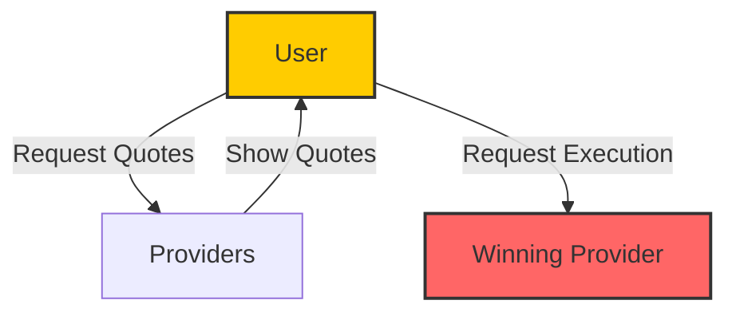
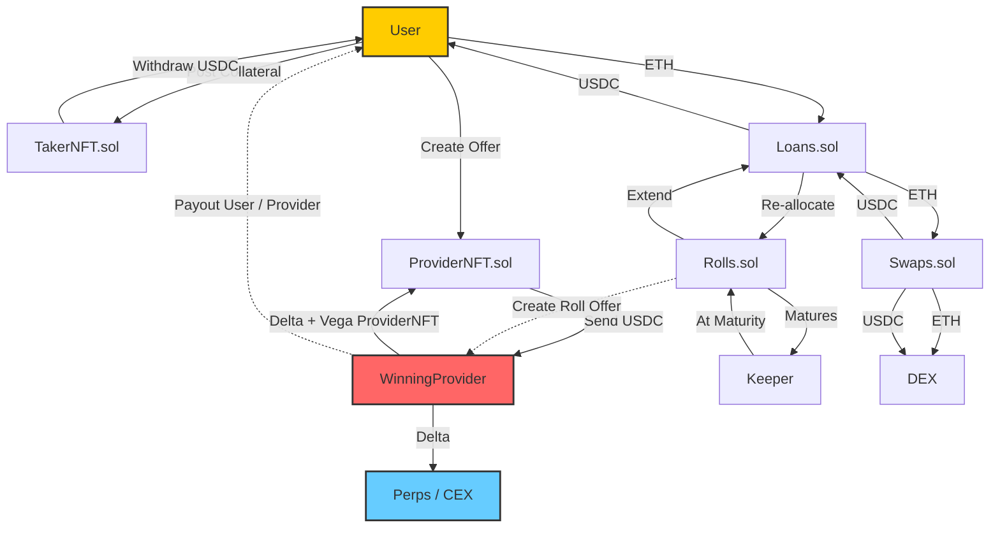

Votre protects borrowers from liquidation risk by hedging collateral upfront rather than waiting for price drops. This ensures liquidation-free borrowing for months at a time.

Votre’s Offchain Intent Platform enables borrowers and providers to negotiate terms before executing onchain transactions, providing just-in-time liquidity provision.

### Coordination Phase (Offchain)

- Borrowers request quotes from whitelisted providers for a return cap.
- Solvers present pricing, and borrowers choose the best offer or select an existing one for a one-click experience.

### Settlement Phase (Onchain)

- Upon acceptance, a provider posts collateral (USDC) to guarantee the borrower’s upside.
- Borrowers then post their collateral, which is swapped via Uniswap v3 to remove price risk.
- Borrowers receive a loan amount based on the loan-to-value (LTV) ratio, while the remaining asset stays locked for settlement.

### Managing & Exiting Positions

- Borrowers can roll (extend) their loans, adjusting terms as market conditions change.
- “Auto-roll” functionality simplifies this process for assets that increase in value.
- Positions are NFTs, meaning they can be sold, transferred, or settled early via “novations” and “unwinds”.

### Loan Repayment & Maturity

- Loans must be repaid before maturity, with a 5-day grace period.
- Once matured, collateral is divided based on market prices and trade terms.
<!-- - A keeper service can handle repayment automatically if pre-authorized. -->

<!-- ### Future Enhancements

- Supplier Mode: A new feature under development that could offer better tax treatment and avoid selling collateral. -->

Votre’s unique approach ensures borrowers have liquidation-free loans while providers efficiently hedge risk.
